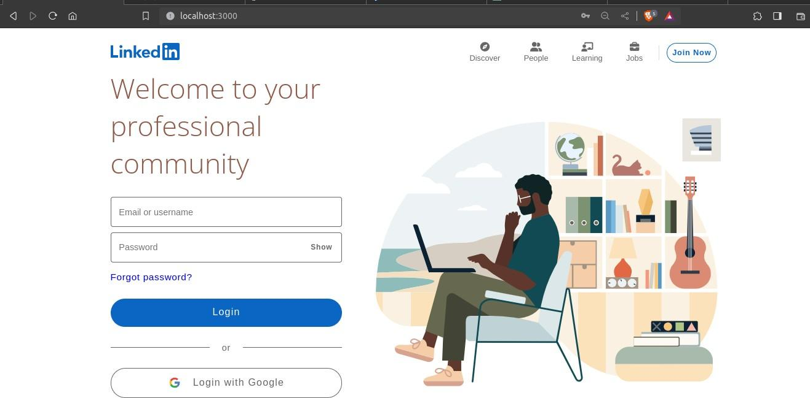
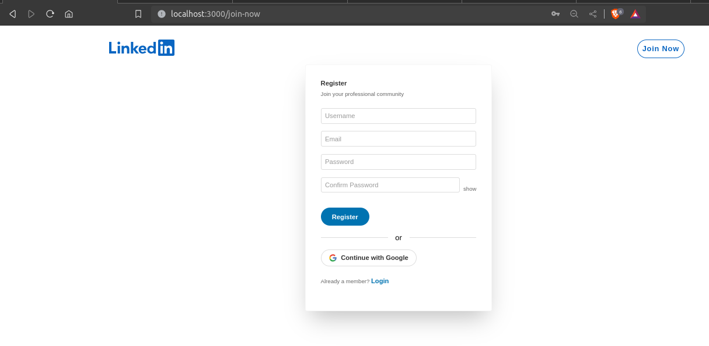
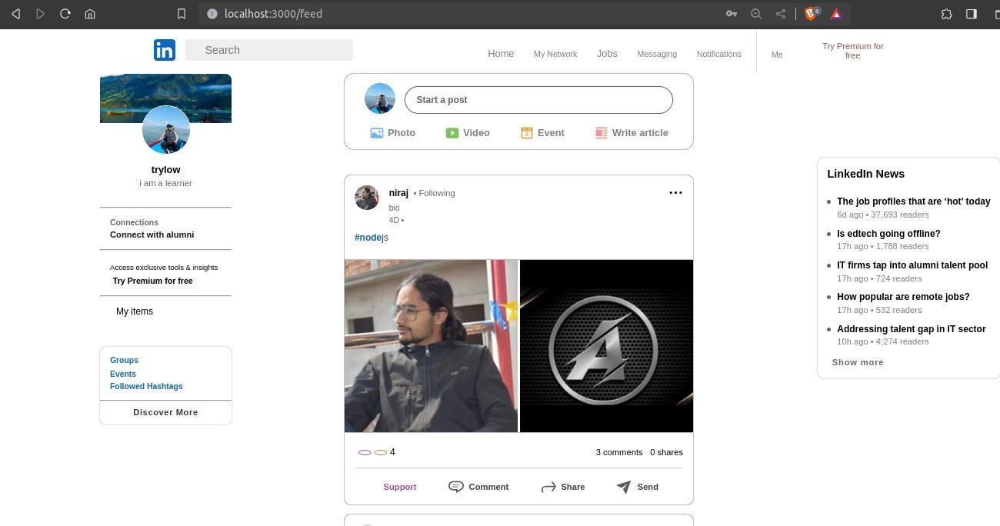
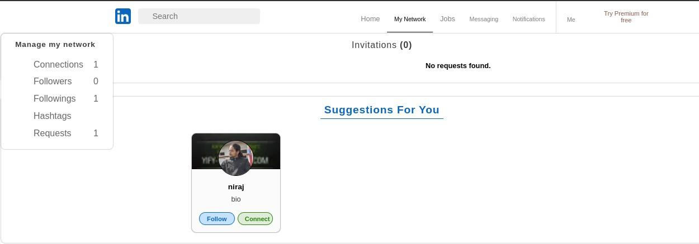
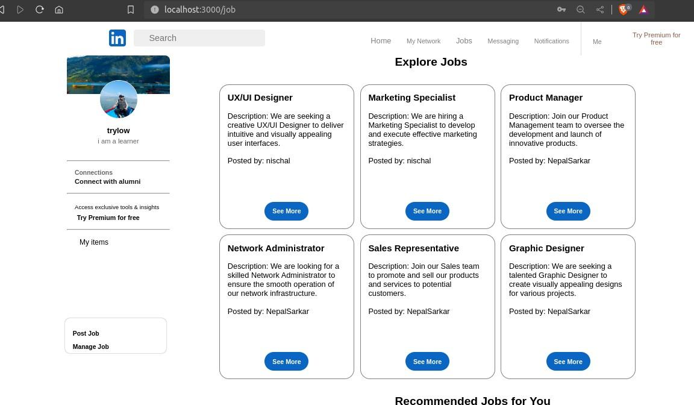
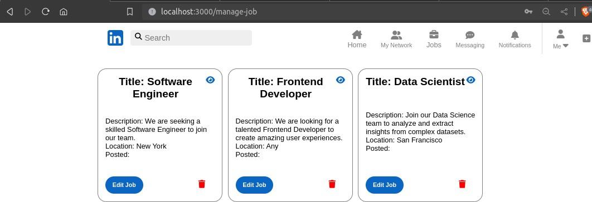
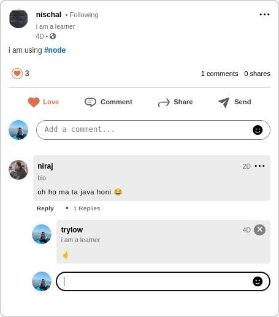
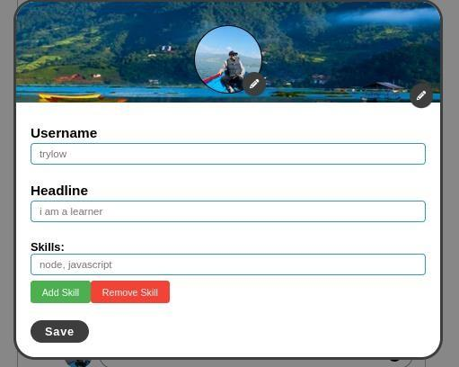
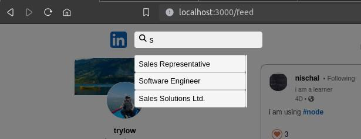
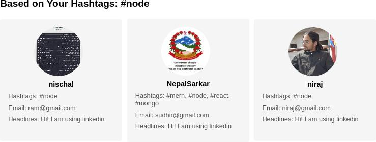

# JobHub

JobHub is a cutting-edge platform designed to mirror the features of LinkedIn, leveraging advanced technologies to elevate user experience and functionality.

<p align="center">
  ·
  <a href="https://github.com/trylow10/jobhub/issues">Report Bug</a>
  ·
  <a href="https://github.com/trylow10/jobhub/issues">Request Feature</a>
  ·
</p>

## Tech Stack

### Frontend

- [React](https://reactjs.org/): A declarative, efficient, and flexible JavaScript library for building user interfaces.
- [Styled Components](https://styled-components.com/): Visual primitives for the component age.

### Backend

- [Node.js](https://nodejs.org/): A JavaScript runtime built on Chrome's V8 JavaScript engine.
- [Express.js](https://expressjs.com/): Fast, unopinionated, minimalist web framework for Node.js.
- [MongoDB](https://www.mongodb.com/): A NoSQL database for modern applications.
- [ImageKit SDK](https://docs.imagekit.io/getting-started/introduction): SDK for handling image uploads and manipulations.

### Additional Integrations

- [Elasticsearch](https://www.elastic.co/elasticsearch/): A distributed, RESTful search and analytics engine.
- [Cosine Similarity](https://en.wikipedia.org/wiki/Cosine_similarity): A mathematical measure to calculate similarity between entities.

## Features

- Image management for enhanced user profiles using ImageKit.
- Advanced search functionality powered by Elasticsearch.
- Sophisticated matching algorithm utilizing cosine similarity.

## Getting Started

1. **Clone the repository:**
   ```bash
   git clone https://github.com/yourusername/jobhub.git
   cd jobhub
   ```

2. **Install dependencies for both the frontend and backend:**
   ```bash
   cd frontend
   npm install
   cd ../backend
   npm install
   ```

3. **Setup MongoDB with Compass:**

   - Download and install MongoDB from [MongoDB official website](https://www.mongodb.com/).

   - Additionally, install MongoDB Compass for a graphical interface to interact with MongoDB. You can download it from [MongoDB Compass](https://www.mongodb.com/try/download/compass).

   - Follow the installation instructions provided by MongoDB to set up and configure MongoDB and MongoDB Compass on your system.

4. **Setup Elasticsearch with Kibana:**
   - Download and install Elasticsearch and Kibana.
   - Follow the official documentation for [Setting Up Elasticsearch](https://www.elastic.co/guide/en/elasticsearch/reference/current/setup.html) and [Setting Up Kibana](https://www.elastic.co/guide/en/kibana/current/setup.html).

5. **Configure environment variables:**
   - Create a `.env` file in the backend directory and copy `example.env` to it with your credentials.

6. **Start the frontend and backend servers:**
   ```bash
   cd frontend
   npm start
   ```
   ```bash
   cd backend
   npm start
   ```

7. **Visit [http://localhost:3000](http://localhost:3000) to explore JobHub!**

## Screenshot
<p align="center">
  <!-- Add your screenshots here -->
  
  
  
  
  
  
  
  
  
  
  <!-- Add more screenshots as needed -->

</p>

Feel free to contribute or report issues. Happy coding!
